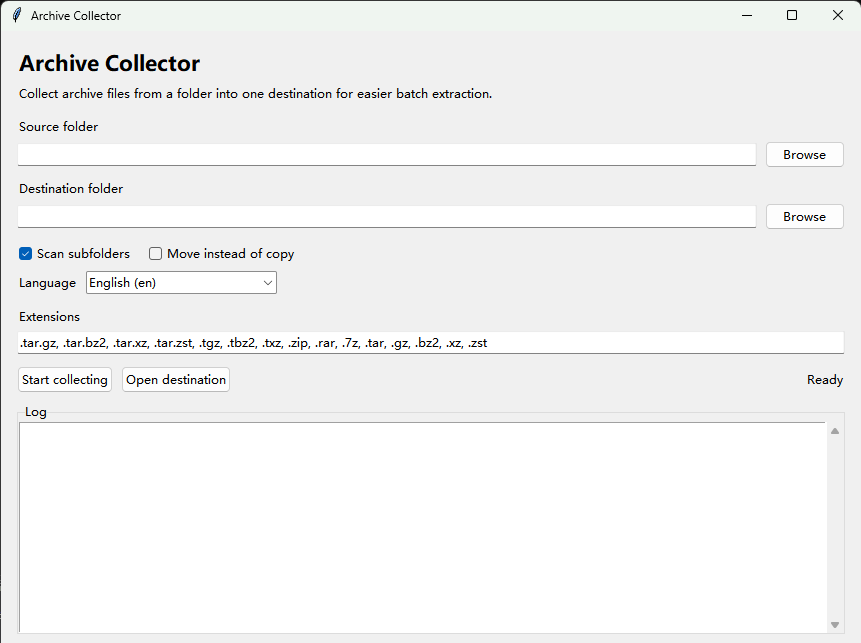

# Archive Collector

Collect ZIP, RAR, 7z, and tar archives into one folder with a simple multilingual GUI/CLI.



Archive Collector is a small local tool that scans a folder for archive files and collects them into one destination folder. It is useful when downloads, backups, or project folders contain archives scattered across many subfolders.

## Features

- GUI and CLI modes
- Copy or move archive files
- Recursive scanning, with an option to scan only the top level
- Automatic duplicate-name handling
- Unicode paths and filenames
- English by default, with built-in language files for Chinese, French, German, and Japanese
- Easy community translations through `locales/<language-code>.json`

## Requirements

- Python 3.10 or newer
- Tkinter, which is included with most standard Python installers

## Supported Archive Extensions

`.zip`, `.rar`, `.7z`, `.tar`, `.gz`, `.bz2`, `.xz`, `.zst`, `.tgz`, `.tbz2`, `.txz`, `.tar.gz`, `.tar.bz2`, `.tar.xz`, `.tar.zst`

You can override the list with `--extensions`.

## Usage

On Windows, double-click `launch.bat` to open the GUI.

Open the GUI from a terminal:

```powershell
python archive_collector.py --gui
```

Run in CLI mode:

```powershell
python archive_collector.py "D:\Downloads" "D:\Archives" --cli
```

Move files instead of copying them:

```powershell
python archive_collector.py "D:\Downloads" "D:\Archives" --cli --move
```

Scan only the top-level source folder:

```powershell
python archive_collector.py "D:\Downloads" "D:\Archives" --cli --flat
```

Use custom extensions:

```powershell
python archive_collector.py "D:\Downloads" "D:\Archives" --cli --extensions ".zip,.rar,.7z"
```

Start with another language:

```powershell
python archive_collector.py --gui --lang ja
python archive_collector.py "D:\Downloads" "D:\Archives" --cli --lang de
```

List available languages:

```powershell
python archive_collector.py --list-languages
```

## Adding Translations

1. Copy `locales/en.json` to `locales/<language-code>.json`, for example `locales/es.json`.
2. Translate the values, but keep the keys unchanged.
3. Keep placeholders such as `{path}`, `{found}`, and `{errors}` exactly as they are.
4. Run `python archive_collector.py --list-languages` and confirm the new language appears.

English is the fallback language. Missing keys in any translation file automatically fall back to English.
